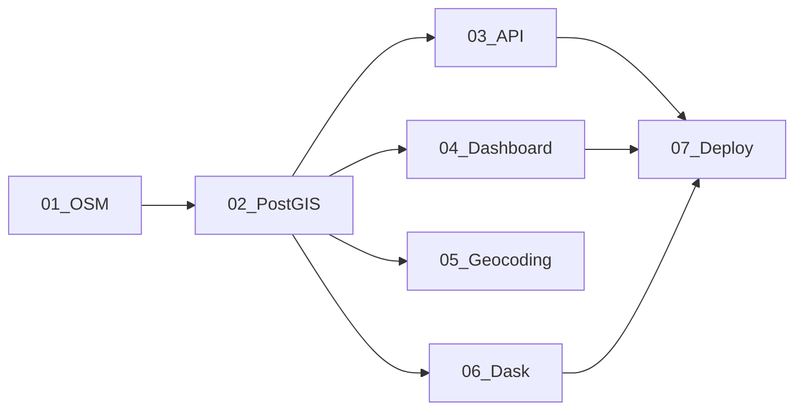

# Notebooks de la Clase 04 - Pipeline de Desarrollo Geoespacial

## Estructura Completa de Notebooks

### ✅ Notebooks Creados:

#### 1. **01_conexion_osm.ipynb** - Adquisición de Datos
- Conexión a OpenStreetMap con OSMnx 2.0
- Descarga de red vial y POIs
- Análisis de isócronas
- Guardado en GeoJSON
- **Cubre slides**: 5-8 de la presentación

#### 2. **02_postgis_database.ipynb** - Almacenamiento y Consultas
- Conexión a PostGIS (Docker)
- Carga de datos espaciales
- Consultas SQL espaciales
- Índices y optimización
- Funciones PL/pgSQL
- **Cubre slides**: 9-12 de la presentación

#### 3. **03_api_fastapi.ipynb** - API REST
- Creación de API con FastAPI
- Endpoints geoespaciales
- Validación con Pydantic
- Búsqueda por radio
- Análisis de área
- **Cubre slides**: 21-22 de la presentación

### 📝 Notebooks Por Crear:

#### 4. **04_dashboard_streamlit.ipynb** - Visualización Interactiva
```python
# Contenido sugerido:
- Crear dashboard con Streamlit
- Mapas interactivos con Folium
- Filtros dinámicos
- Gráficos estadísticos
- Conexión a PostGIS
- Deploy local
```
**Cubrirá slides**: 23-24

#### 5. **05_geocoding_clustering.ipynb** - Geocodificación y Clustering
```python
# Contenido sugerido:
- Geocoding con Nominatim
- Geocoding reverso
- Clustering espacial (DBSCAN, K-means)
- Análisis de hotspots
- Visualización de clusters
```
**Cubrirá slides**: 13-16

#### 6. **06_optimizacion_dask.ipynb** - Procesamiento Paralelo
```python
# Contenido sugerido:
- Dask para grandes datasets
- Procesamiento paralelo de geometrías
- Dask-GeoPandas
- Optimización de memoria
- Benchmarking
```
**Cubrirá slides**: 25-26

#### 7. **07_deployment_docker.ipynb** - Despliegue
```python
# Contenido sugerido:
- Dockerización de la aplicación
- Docker Compose para servicios
- CI/CD básico
- Monitoreo con logs
- Mejores prácticas
```
**Cubrirá slides**: 27-28

## Flujo de Trabajo Completo



## Datos Compartidos

Los notebooks comparten datos a través de:
1. **Archivos GeoJSON** en `../data/processed/`
2. **Base de datos PostGIS** en Docker
3. **Variables de entorno** para credenciales

## Requisitos Técnicos

### Por Notebook:
- **01**: osmnx, geopandas, folium, networkx
- **02**: sqlalchemy, psycopg2, geopandas
- **03**: fastapi, uvicorn, pydantic
- **04**: streamlit, plotly, folium
- **05**: geopy, scikit-learn, hdbscan
- **06**: dask, dask-geopandas
- **07**: docker, docker-compose

### Servicios Docker Necesarios:
- ✅ PostGIS (puerto 5433)
- ✅ Redis (puerto 6380)
- ✅ pgAdmin (puerto 5050)
- ✅ JupyterLab (puerto 8888)

## Instrucciones para Estudiantes

### Orden Recomendado:
1. **Comenzar con 01**: Obtener datos reales
2. **Continuar con 02**: Almacenar en base de datos
3. **Elegir ruta**:
   - **Backend**: Notebook 03 (API)
   - **Frontend**: Notebook 04 (Dashboard)
   - **Análisis**: Notebook 05 (Geocoding/Clustering)
   - **Optimización**: Notebook 06 (Dask)

### Para el Proyecto Final:
- Combinar elementos de todos los notebooks
- Crear pipeline completo desde datos hasta visualización
- Documentar decisiones técnicas
- Incluir tests básicos

## Recursos Adicionales

### Documentación:
- [OSMnx 2.0](https://osmnx.readthedocs.io/)
- [PostGIS](https://postgis.net/documentation/)
- [FastAPI](https://fastapi.tiangolo.com/)
- [Streamlit](https://docs.streamlit.io/)
- [Dask](https://docs.dask.org/)

### Datos de Ejemplo:
- Red vial de Las Condes
- POIs (hospitales, colegios, parques)
- Comunas de Santiago (GeoJSON)

## Troubleshooting

### Errores Comunes:

1. **OSMnx ImportError**:
   ```bash
   pip install scikit-learn scipy
   ```

2. **PostGIS connection refused**:
   ```bash
   docker-compose up -d
   # Usar puerto 5433 no 5432
   ```

3. **Redis connection error**:
   ```bash
   # Usar puerto 6380 no 6379
   ```

4. **Jupyter kernel not found**:
   ```bash
   python -m ipykernel install --user --name=venv_geo
   ```

## Evaluación

### Criterios para Proyecto:
- **Funcionalidad** (40%): Pipeline completo funcionando
- **Código** (30%): Calidad, documentación, estructura
- **Análisis** (20%): Insights geoespaciales válidos
- **Presentación** (10%): Visualización y comunicación

### Entregables:
1. Notebooks ejecutables
2. Datos procesados
3. README con instrucciones
4. Presentación de 10 minutos